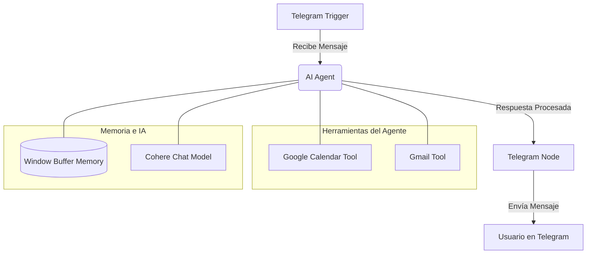

# 🤖 Asistente de IA en Telegram (Workflow de n8n)


Este proyecto implementa un asistente virtual inteligente en Telegram utilizando **n8n**. El agente está impulsado por el modelo de lenguaje de **Cohere** y cuenta con memoria contextual, además de integración directa con Google Calendar y Gmail.

> **Estado:** Sistema en expansión 🚀


## ✨ Características

*   **Atención vía Telegram:** Recibe y envía mensajes directamente a través de un Bot de Telegram.
*   **Agente de Inteligencia Artificial:** Utiliza el modelo *Cohere Chat Model* para interpretar los mensajes y tomar decisiones.
*   **Memoria de Conversación (*Simple Memory*):** Mantiene el contexto de la conversación con el usuario, recordando interacciones anteriores.
*   **Integración con Google Calendar:**
    *   Consulta de eventos en la agenda.
    *   (Expandible para creación y modificación de eventos).
*   **Integración con Gmail:** Envío de correos electrónicos automatizados o a pedido, interpretados por el modelo de chat.

## 🛠️ Tecnologías Utilizadas

*   **[n8n](https://n8n.io/):** Plataforma de automatización de flujos de trabajo.
*   **Telegram Bot API:** Interfaz de comunicación con el usuario.
*   **Cohere API:** Proveedor del modelo de Inteligencia Artificial.
*   **Google APIs:** Calendar y Gmail.
*   **Docker:** Para la contenedorización de n8n de forma local.
*   **Ethereal:** Para correos electrónicos de prueba.
*   **ngrok:** Para exponer el n8n local a internet.

## 🔄 Arquitectura del Workflow (n8n)

El flujo principal en n8n sigue esta estructura:



### Cómo funciona el flujo:
1.  **Telegram Trigger:** Escucha activamente los mensajes enviados al Bot de Telegram.
2.  **AI Agent:** El nodo principal que gestiona la lógica. Recibe el mensaje de Telegram y consulta las siguientes dependencias:
    *   **Chat Model:** Utiliza Cohere para el procesamiento del lenguaje natural.
    *   **Memory:** Extrae el historial reciente de la conversación.
    *   **Tools (Herramientas):** Basado en la intención del usuario, el Agente decide si necesita llamar a Google Calendar (para consultar eventos) o a Gmail (para enviar correos electrónicos).
3.  **Telegram Node (Output):** La respuesta final generada por el Agente de IA se envía de vuelta al usuario en Telegram.

## 🚀 Cómo Ejecutar el Proyecto

### Requisitos previos
*   Docker y Docker Compose instalados.
*   Credenciales de la API de Telegram (Bot Token a través de BotFather).
*   Clave de API de Cohere.
*   Credenciales de Google Cloud (OAuth2 para Gmail y Calendar).
*   [Ngrok](https://ngrok.com/) o similar (para exponer el n8n local para el webhook de Telegram).

### Pasos para ejecutar:
1.  Inicia n8n mediante Docker Compose:
    ```bash
    docker-compose up -d
    ```
2.  Inicia el túnel para exponer el puerto de n8n (ej: puerto 5678) a internet:
    ```bash
    ./tunnel.sh
    ```
3.  Accede a n8n en `http://localhost:5678`.
4.  Configura tus credenciales en n8n (Telegram, Cohere y Google OAuth2).
5.  Importa tu archivo de workflow de n8n (`.json`) o reconstrúyelo basándote en la arquitectura anterior.
6.  ¡Activa el workflow!

## 📈 Próximos Pasos (Expansión)

- [ ] Implementar la programación automática de reuniones en Calendar a través del chat.
- [ ] Leer resúmenes de correos electrónicos importantes recibidos en Gmail.
- [ ] Soporte para múltiples usuarios con bases de datos aisladas (PostgreSQL/Prisma).

---
*Creado por Juan Sanz con automatización e IA.*
